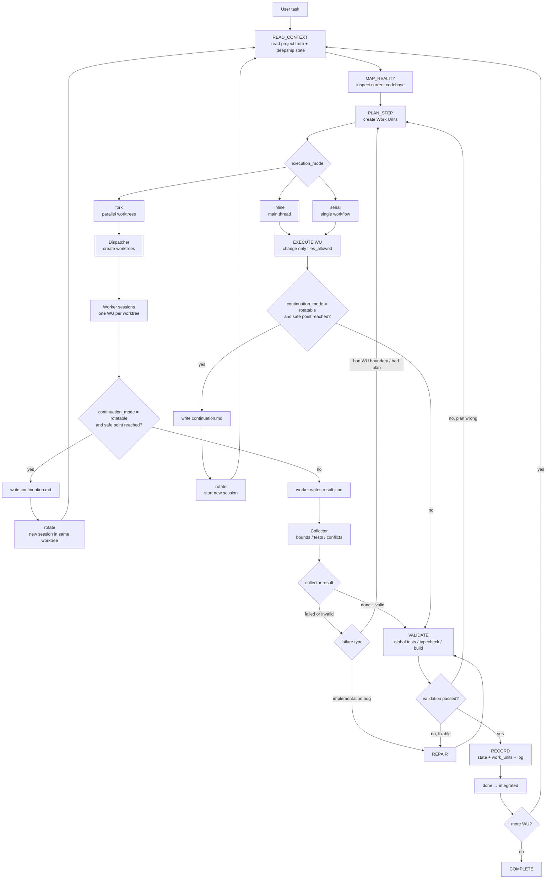

# DEEPSHIP v0.1.0-rc.1

> **可恢复分段自治的 AI 工程执行协议。**
>
> 不是”让模型无限自治”的 prompt。是一套执行纪律：把长任务拆成可检查的 Work Unit，用状态机约束推进，用 `.deepship/` 文件系统保存现场，用 fork 分会话并行，用 rotate 跨会话续命。

## Why

AI 编程代理最容易失败的地方，不是不会写代码，而是长时间工作时会散：

- 做着做着忘了原计划
- 一边改 hook，一边顺手改 UI、CSS、DB，边界失控
- 子会话说“完成了”，但没人验收它到底改了什么
- 上下文快满时直接失忆，下一轮靠猜
- prompt 里写了一百条规则，但执行点没有牙齿

DEEPSHIP 的目标是给这些行为加一套工程纪律：**每一步都能恢复、能审计、能拒绝、能集成。**

## Core Idea

DEEPSHIP 把一次 AI 工程任务拆成几个稳定概念：

| Concept | Meaning |
|---------|---------|
| **State Machine** | 当前处在读上下文、规划、执行、验证、记录还是完成 |
| **Work Unit (WU)** | 一块有目标、边界、允许文件和验收测试的小任务 |
| **Policy Gate** | 在错误状态或越界文件上拒绝工具调用 |
| **Persistence** | `.deepship/state.json`, `work_units.json`, `log.jsonl` 保存现场 |
| **Fork** | 对已规划、文件边界清晰的任务开 worktree/子会话并行 |
| **Rotate** | 上下文快满时写 checkpoint，启动新会话继续 |
| **Collector** | 回收子会话结果，检查边界、测试证据和冲突 |
| **Conformance Cases** | 让不同 runtime 证明自己真的实现了这套纪律 |

一句话：**DEEPSHIP 让“AI 说做完了”变成“系统验收通过了”。**

## Execution Flow



The important split is two-axis:

- `execution_mode` decides the execution topology: `inline`, `serial`, or `fork`.
- `continuation_mode` decides whether the current workflow may rotate at a safe checkpoint.

So `rotatable` is not a fourth execution mode. A serial WU can rotate in the main workflow, and a forked worker can rotate inside its own worktree. Collector failures also have a real loop: implementation bugs go to `REPAIR`; bad boundaries or bad planning go back to `PLAN_STEP`.

## Work Unit Example

```json
{
  "id": "WU-004",
  "goal": "Implement useClassroom hook",
  "scope": "Orchestrate planner, session, AI, and DB persistence. Do not change UI.",
  "files_allowed": [
    "frontend/src/hooks/useClassroom.ts",
    "frontend/src/hooks/useClassroom.test.ts"
  ],
  "acceptance_tests": [
    "useClassroom.test.ts passes",
    "frontend tsc passes"
  ],
  "owner": "orchestrator",
  "status": "pending"
}
```

`files_allowed` 是纪律边界。执行中发现预估错了，可以回 `PLAN_STEP` 扩边界或拆新 WU，但不应该偷偷越界。

## Repository Map

| Path | Purpose |
|------|---------|
| `core/manifest.md` | Claude Code 常驻入口，状态机和规则加载触发器 |
| `rules/states/` | 每个状态的 JIT 检查表 |
| `rules/protocols/` | Work Unit 和日志格式细则 |
| `protocol/` | runtime 实现要遵守的权威纪律定义 |
| `schemas/` | `.deepship/*` 和 conformance case 的 JSON schema |
| `tests/conformance/` | Policy / transition / WU / persistence 标准测试集 |
| `adapters/claude-code/` | Claude Code adapter 说明 |
| `adapters/parallel/` | fork / collector 的 worktree 并行执行器 |
| `adapters/mate/` | Mate runtime 参考实现方向 |
| `checks/verify.py` | DEEPSHIP 自检脚本 |

## Quick Checks

```bash
python checks/verify.py
python -m unittest tests.conformance.test_cc_hook_policy
python -m unittest tests.conformance.test_global_deepship_policy_guard
```

当前 `verify.py` 检查：

- 状态机一致性
- JIT 规则结构
- 持久化状态格式
- Work Unit 纪律完整性
- conformance case 覆盖
- adapter 文档完整性

## Claude Code Usage

DEEPSHIP 在 Claude Code 中通过三层生效：

1. `core/manifest.md` 作为常驻入口，提醒模型按状态机工作
2. `rules/states/*.md` 在进入状态时 JIT 加载
3. PreToolUse hook 对写文件行为做 adapter 级门禁

Claude Code adapter 不是完整 runtime。它可以拦截很多越界行为，但真正不可绕过的硬执行层应该由 Mate 这类 runtime 在 `ToolRegistry.execute()` 层实现。

## Fork And Rotate

DEEPSHIP 区分两件事：

- **fork**：一个已规划任务拆成多个 worktree/子会话并行执行
- **rotate**：同一个任务在上下文快满时保存 checkpoint，换新会话继续

fork 是执行拓扑，rotate 是上下文续命。两者可以组合，但都必须有清晰 checkpoint 和回收规则。

## Status

DEEPSHIP 现在处于实验性工程纪律阶段：

- ✅ 状态机、Work Unit、persistence、policy、conformance 已定义
- ✅ Claude Code hook 和 parallel dispatcher 已有 v0.1
- ✅ collector 可检查边界、测试证据和冲突
- 🚧 rotate 仍在设计/实现中
- 🚧 Mate runtime 的硬门禁仍是长期方向

## License

MIT
