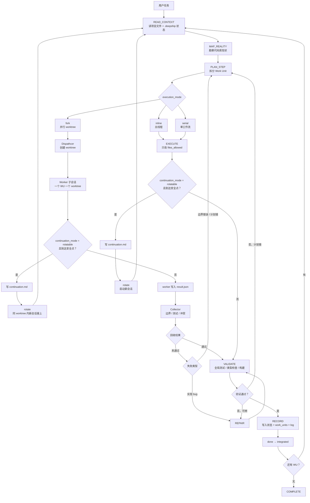

# DEEPSHIP v0.1.0-rc.1

> **可恢复分段自治的 AI 工程执行协议。**
>
> 不是"让模型无限自治"的 prompt。是一套执行纪律：把长任务拆成可检查的 Work Unit，用状态机约束推进，用 `.deepship/` 文件系统保存现场，用 fork 分会话并行，用 rotate 跨会话续命。

## 解决什么问题

AI 编程代理长时间工作最容易散——不是因为不会写代码：

- 做着做着忘了原计划
- 改 hook 顺手改 UI、CSS、DB，边界失控
- 子会话报告"完成了"，但没人验收它到底改了什么
- 上下文快满时直接失忆，下一轮纯靠猜
- prompt 写了一百条规则，但执行点没牙齿

DEEPSHIP 加一套工程纪律：**每一步都能恢复、能审计、能拒绝、能集成。**

## 核心概念

| 概念 | 做什么 |
|------|--------|
| **状态机** | 当前在哪个阶段——读上下文、勘察、规划、执行、验证、记录还是完成 |
| **Work Unit（WU）** | 一块有目标、有边界、有允许文件和验收测试的小任务 |
| **策略门禁** | 在错误状态或越界文件上直接拒绝工具调用 |
| **持久化** | `.deepship/state.json`、`work_units.json`、`log.jsonl` 保存现场 |
| **Fork** | 对已规划、文件边界清晰的任务开 worktree/子会话并行 |
| **Rotate** | 上下文快满时写 checkpoint，启动新会话无缝接上 |
| **Collector** | 回收子会话结果——检查边界、测试证据、跨 WU 冲突 |
| **一致性用例** | 让不同 runtime 证明自己真的实现了这套纪律 |

一句话：**DEEPSHIP 让"AI 说做完了"变成"系统验收通过了"。**

## 执行流程



关键区分——两轴模型：

- `execution_mode` 管执行拓扑：`inline`、`serial`、`fork`
- `continuation_mode` 管上下文续命：`normal`、`rotatable`

`rotatable` 不是第四种执行模式。串行 WU 可以在主工作流中 rotate，fork 出的 worker 也可以在自己的 worktree 里 rotate。Collector 失败有真实回路：实现 bug 进 `REPAIR`，边界或计划错回 `PLAN_STEP`。

## Work Unit 示例

```json
{
  "id": "WU-004",
  "goal": "实现 useClassroom hook",
  "scope": "编排 planner、session、AI、DB 持久化。不改 UI。",
  "files_allowed": [
    "frontend/src/hooks/useClassroom.ts",
    "frontend/src/hooks/useClassroom.test.ts"
  ],
  "execution_mode": "serial",
  "continuation_mode": "normal",
  "acceptance_tests": [
    "useClassroom.test.ts 通过",
    "frontend tsc 通过"
  ],
  "status": "pending"
}
```

`files_allowed` 是纪律边界。执行中发现预估错了，可以回 `PLAN_STEP` 扩边界或拆新 WU，但不应该偷偷越界。

## 仓库结构

| 路径 | 用途 |
|------|------|
| `core/manifest.md` | Claude Code 常驻入口——状态机骨架和规则加载触发器 |
| `rules/states/` | 每个状态的 JIT 检查表 |
| `rules/protocols/` | Work Unit 和日志格式细则 |
| `protocol/` | 权威协议层——runtime 实现必须遵守的纪律定义 |
| `schemas/` | `.deepship/*` 和一致性用例的 JSON Schema |
| `tests/conformance/` | 策略 / 转移 / WU / 持久化标准测试集 |
| `adapters/claude-code/` | Claude Code adapter——hook 门禁 + 局限性说明 |
| `adapters/parallel/` | Fork / Collector / Rotate 的 worktree 并行执行器 |
| `adapters/mate/` | Mate runtime 参考实现方向 |
| `checks/verify.py` | DEEPSHIP 框架自检脚本 |

## 快速检查

```bash
python checks/verify.py
python -m unittest discover -s tests/conformance -p "test_*.py" -v
```

`verify.py` 检查项：状态机一致性、JIT 规则结构、持久化状态格式、WU 纪律完整性、一致性用例覆盖、adapter 文档完整性。

## Claude Code 中的用法

DEEPSHIP 在 Claude Code 中通过三层生效：

1. `core/manifest.md` 作为常驻入口——提醒模型按状态机推进
2. `rules/states/*.md` 在进入每个状态时 JIT 加载
3. PreToolUse hook 对写文件行为做 adapter 级门禁

Claude Code adapter 不是完整 runtime——它可以拦截很多越界行为，但真正不可绕过的硬执行层应该由 Mate 这类 runtime 在 `ToolRegistry.execute()` 层实现。

## Fork 和 Rotate

DEEPSHIP 区分两件事：

- **fork**：一个已规划任务拆成多个 worktree/子会话并行执行
- **rotate**：同一个任务在上下文快满时保存 checkpoint，换新会话继续

fork 是执行拓扑，rotate 是上下文续命。两者可以组合——但都必须有清晰的 checkpoint 和回收规则。

## 当前状态

DEEPSHIP 处于实验性工程纪律阶段（v0.1.0-rc.1）：

- ✅ 状态机、Work Unit、持久化、策略门禁、一致性用例已定义
- ✅ Claude Code hook 和并行 dispatcher 已实现 v0.1
- ✅ collector 可检查边界、测试证据和跨 WU 冲突
- ✅ rotate 已实现 checkpoint + 新终端启动 + 硬门禁
- 🚧 全自动上下文旋转（杀旧进程）仍需设计
- 🚧 Mate runtime 的硬门禁仍是长期方向

## Lane Storage

Lane state is managed inside `.deepship`, not in sibling project folders.

```text
.deepship/
  lanes.json
  lanes/
    <lane-name>/              # this directory is the lane worktree root
      .deepship/
        lane.json
        state.json
        work_units.json
        handoff.md
      Prompt.md
```

`adapters/lane/lane.py create <name>` creates a git worktree at
`.deepship/lanes/<name>/`. The lane's own DEEPSHIP runtime state lives inside
that worktree at `.deepship/lanes/<name>/.deepship/`, so a conversation opened
inside the lane can continue the normal DEEPSHIP state machine. The old
`<project>-lanes/` sibling layout is treated as legacy only.

New conversations do not automatically create lanes. They first run dynamic
session arbitration:

- `duplicate`: stop; the active owner is already doing it.
- `belongs_to_current_owner`: send an A2A handoff to the active owner and ask it
  to pause, reconcile the plan, and continue.
- `new_goal_requires_lane`: create a plan revision plus an A2A contract before
  creating a lane/worktree.
- `plan_conflict`: ask the active owner to stop and replan from the revised
  plan.

Lane teardown is explicit:

```bash
python adapters/lane/lane.py finalize <name>          # dry-run
python adapters/lane/lane.py finalize <name> --apply  # merge, archive metadata, remove worktree
```

`finalize --apply` archives lane metadata under `.deepship/lanes-archive/`,
removes the lane worktree and branch, and removes the registry entry after a
successful merge.

## License

MIT
