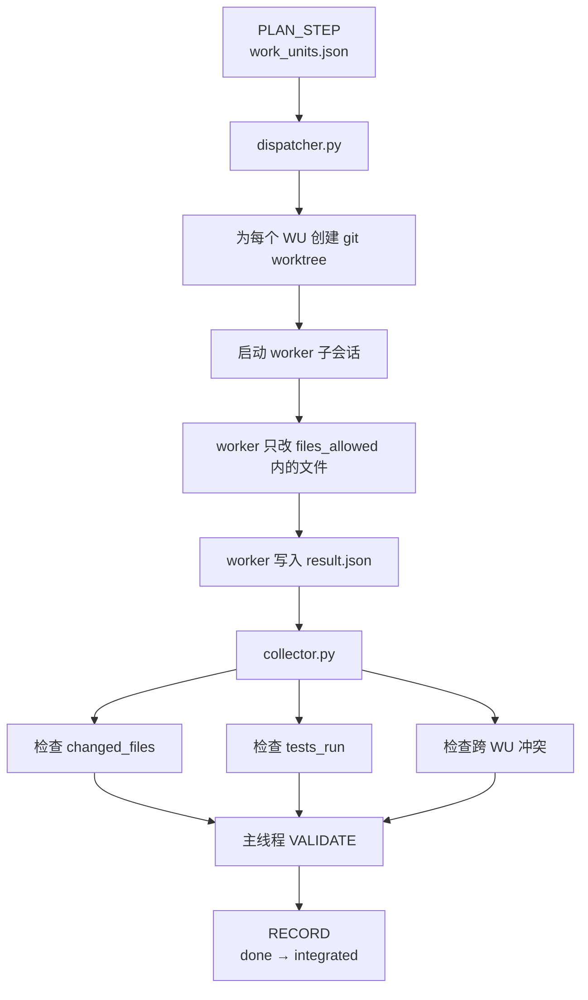

# 并行适配器

> 基于 worktree 隔离的 fork/collector 适配器——DEEPSHIP 执行纪律的分会话并行实现。

本适配器负责 DEEPSHIP 的 **fork** 侧：当 PLAN_STEP 已把任务拆成独立 Work Unit 后，为互不依赖的 WU 创建隔离 git worktree，让多个 Claude Code 会话真并行工作。

它不取代 DEEPSHIP 主循环。规划、验证、记录和最终集成仍由主线程掌控。

## 什么时候用 fork

Fork 用于**已规划的并行**，不用于临时冲动并行。

同时满足以下条件才用：

- PLAN_STEP 已产出多个 `status: pending` 的 WU
- 这些 WU 的 `depends_on` 均已满足
- `files_allowed` 互不重叠
- 每个 WU 都有验收测试或明确的验收断言
- 任务大到并行带来的协调成本值得

**不要**在小改动、边界模糊、共享文件重构、或计划还在变动时用 fork。

## 流程



## 命令

```bash
# 查看可调度 WU
python adapters/parallel/dispatcher.py --mode check

# 创建 worktree、启动终端、监控、汇总
python adapters/parallel/dispatcher.py --mode auto

# 只调度指定 WU
python adapters/parallel/dispatcher.py --wu WU-001,WU-002

# 启动终端但不监控
python adapters/parallel/dispatcher.py --mode auto --no-monitor

# 回收并验证 worker 结果
python adapters/parallel/collector.py

# 回收 + 验证 + 合并 + 清理（完整流程）
python adapters/parallel/collector.py --apply --cleanup

# 回收 + 展示 diff
python adapters/parallel/collector.py --show-diff
```

## Worker 契约

每个 worker 写入：

```json
{
  "wu_id": "WU-001",
  "status": "done",
  "changed_files": ["src/auth.py"],
  "tests_run": ["pytest tests/test_auth.py -v"],
  "summary": "添加了认证日志中间件",
  "risks": null
}
```

Worker **不得修改**：

- `.deepship/state.json`
- `.deepship/work_units.json`
- `.deepship/log.jsonl`

`done` 表示"worker 声称它的 WU 已完成"。这不意味着该 WU 已是最终系统的一部分。只有主线程在 collector 检查通过和全局验证后，才能把 `done → integrated`。

## Collector 校验

Collector 逐项验证：

- `result.json` 必填字段完整
- `changed_files ⊆ files_allowed`
- `tests_run` 覆盖 `acceptance_tests`
- 没有两个 worker 修改了同一文件
- 没有 worker 修改了 DEEPSHIP 元数据

未通过 → 回到 `REPAIR` 或 `PLAN_STEP`。

合并用 `--apply` 显式触发：从 worktree 生成 patch → `git apply` 到主仓库。`--cleanup` 必须在 `--apply` 成功后才会执行，防止未合并就清理导致改动丢失。

## Fork、Rotate 和 Lane 的区别

三者解决不同问题：

- **fork**：多个 WU 并行执行（dispatcher 批量分派，非交互）
- **rotate**：单个长任务在安全点保存 checkpoint，换新会话继续
- **lane**：即时创建隔离工作通道（spawn_lane 交互式，"想到就开"）

本适配器实现 fork。Rotate 走 continuation/checkpoint 流程，不走 collector 路径。

## Lane 即时创建

```bash
# 创建交互式 lane（worktree + 独立 CC 会话）
python adapters/parallel/spawn_lane.py --task "重构 gate hook" --files rules/states/execute.md
```

Lane 与 dispatcher 互补：dispatcher 批量分派预定义 WU（`claude -p` 非交互），spawn_lane 即时创建交互式 lane。lane 内自动写 `lane_id.json` 做身份发现，gate hook 通过 `index.json` 做文件冲突检测。
