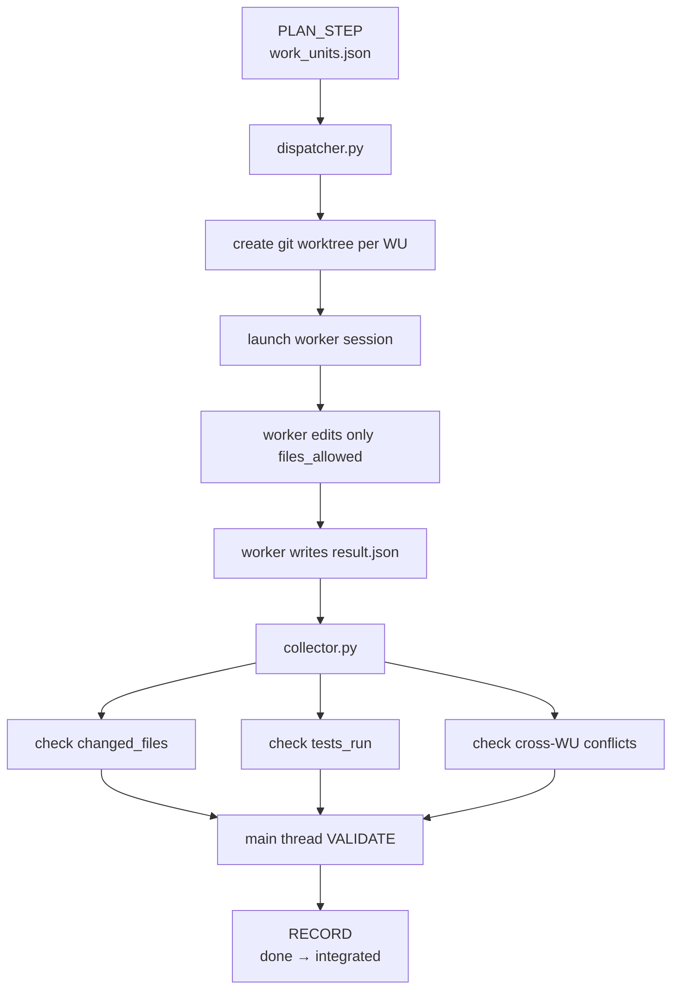

# Parallel Adapter

> Worktree-based fork/collector adapter for DEEPSHIP execution discipline.

This adapter handles the **fork** side of DEEPSHIP: when PLAN_STEP has already split a task into independent Work Units, it can open isolated worktrees and let multiple Claude Code sessions work in parallel.

It does not replace the main DEEPSHIP loop. The main thread still owns planning, validation, recording, and final integration.

## When To Fork

Fork is for planned parallelism, not impulse parallelism.

Use it when all of these are true:

- PLAN_STEP has produced multiple pending WU
- those WU have no unresolved dependencies
- their `files_allowed` sets do not overlap
- each WU has acceptance tests or concrete acceptance assertions
- the task is large enough that parallelism is worth the coordination cost

Do not fork for small edits, unclear scope, shared-file refactors, or tasks where the plan is still moving.

## Flow



## Commands

```bash
# See dispatchable WU
python adapters/parallel/dispatcher.py --mode check

# Create worktrees, launch sessions, monitor, and summarize
python adapters/parallel/dispatcher.py --mode auto

# Dispatch selected WU only
python adapters/parallel/dispatcher.py --wu WU-001,WU-002

# Launch but do not monitor
python adapters/parallel/dispatcher.py --mode auto --no-monitor

# Collect and validate worker results
python adapters/parallel/collector.py

# Collect, show diff, and clean worktrees after successful validation
python adapters/parallel/collector.py --show-diff --cleanup
```

## Worker Contract

Each worker writes:

```json
{
  "wu_id": "WU-001",
  "status": "done",
  "changed_files": ["src/auth.py"],
  "tests_run": ["pytest tests/test_auth.py -v"],
  "summary": "Added auth logging middleware",
  "risks": null
}
```

The worker must not edit:

- `.deepship/state.json`
- `.deepship/work_units.json`
- `.deepship/log.jsonl`

`done` means “the worker claims its WU is complete.” It does not mean the WU is part of the final system. Only the main thread can move `done → integrated` after collector checks and global validation.

## Collector Checks

The collector verifies:

- required `result.json` fields exist
- `changed_files ⊆ files_allowed`
- `tests_run` covers `acceptance_tests`
- no two workers changed the same file
- no worker changed DEEPSHIP metadata

Failed collection sends the work back to REPAIR or PLAN_STEP.

## Fork vs Rotate

Fork and rotate solve different problems:

- **fork**: multiple WU run in parallel
- **rotate**: one long-running WU saves checkpoint and resumes in a new session

This adapter implements fork. Rotate should use a continuation/checkpoint flow, not the collector path.
